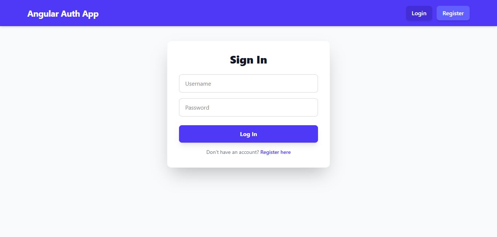
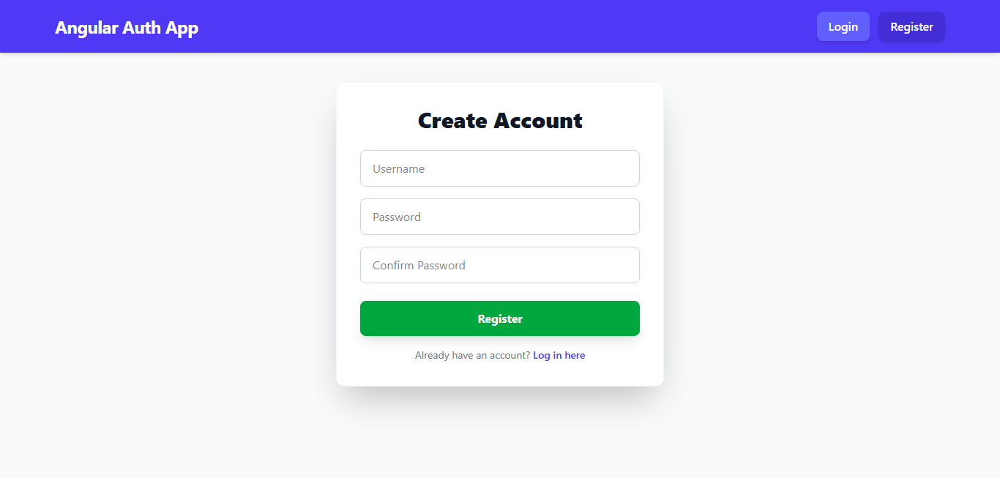
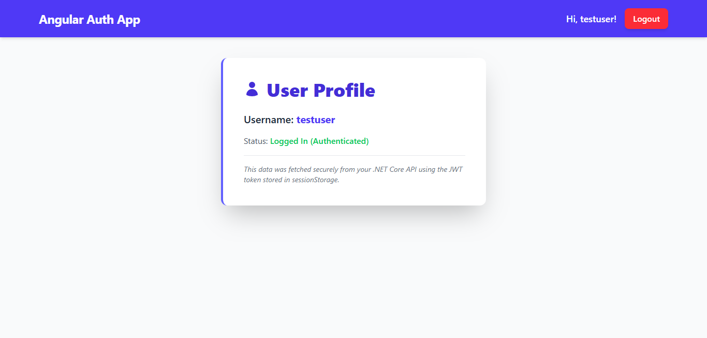

TCC Technical Skill: Full Stack Authentication Appโปรเจกต์นี้รวบรวมโค้ด Front-end (Angular) และ Back-end (C# .NET Core API) สำหรับระบบจัดการสมาชิก (Login, Register, Profile)🏗️ โครงสร้างโปรเจกต์โฟลเดอร์เทคโนโลยีรายละเอียดfrontend/AngularUser Interface (UI) และ Logic สำหรับการโต้ตอบกับผู้ใช้backend/C# .NET APIAPI Endpoints, Business Logic, และการเชื่อมต่อกับฐานข้อมูล (เช่น Postgres)🚀 วิธีการตั้งค่าและรัน (Local Setup)คุณต้องเปิด Terminal/Command Prompt สองหน้าต่างพร้อมกันเพื่อรันทั้งสองส่วนของแอปพลิเคชัน1. การรัน Backend (C# .NET)ใช้ Terminal หน้าต่างที่ 1:เข้าสู่โฟลเดอร์ Backend:cd backend
เรียกคืน Dependencies และรันโปรเจกต์:dotnet restore
dotnet run
API Server มักจะรันอยู่ที่ http://localhost:5000 หรือ 50012. การรัน Frontend (Angular)ใช้ Terminal หน้าต่างที่ 2:เข้าสู่โฟลเดอร์ Frontend:cd frontend
ติดตั้ง Dependencies (ถ้ายังไม่ได้ทำ):npm install
รันโปรเจกต์ Angular:ng serve

